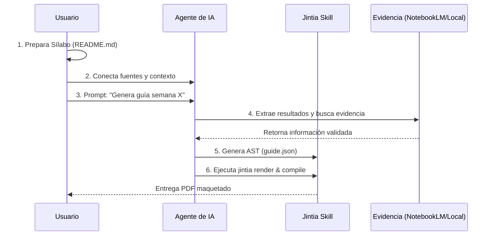
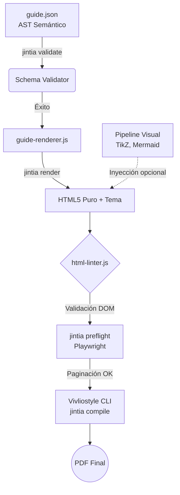

# Jintia

**Motor de Diseño Instruccional Editorial para Agentes de IA** (Claude, ChatGPT y Codex).

Jintia es una *skill* agéntica de código abierto diseñada para producir guías académicas modulares, estructuradas y listas para impresión o distribución digital, garantizando la trazabilidad entre el sílabo, los resultados de aprendizaje y la bibliografía verificable.

> [!NOTE]
> El cliente de escritorio y el instalador gráfico se mantienen en un repositorio independiente:
> [`jintia-desktop`](https://github.com/CharlieCardenasToledo/jintia-desktop).
> Este repositorio contiene únicamente la *skill* base, el motor de renderizado HTML, las pruebas y los artefactos de distribución.

## Capacidades Principales

Jintia ingiere sílabos, configuraciones institucionales y fuentes verificables para generar automáticamente guías de estudio. Su arquitectura incorpora:

- **Estructuración mediante AST (`guide.json`)**: Planificación instruccional y trazabilidad de evidencia con separación total entre contenido y diseño.
- **Motor Editorial HTML**: Renderizado nativo web y compilación a PDF de alta resolución mediante Vivliostyle.
- **Sistema Multitema**: Soporte para distintos perfiles visuales (ej. diseño técnico corporativo, libretas de ejercicios imprimibles).
- **Control de Calidad (Linter y Preflight)**: Validación estricta del esquema semántico y verificación estructural del DOM para evitar errores de impresión.
- **Flujo Multi-Agente**: Contratos especializados para delegación de tareas de investigación, renderizado de figuras y revisión académica.

## Uso y Flujo del Usuario

El usuario final interactúa con Jintia a través de su agente de IA de preferencia (Claude, ChatGPT, etc.) siguiendo este flujo normal:



1. **Preparación del Entorno**: El usuario debe tener en su espacio de trabajo un archivo `README.md` que actúe como el sílabo canónico del curso (con resultados de aprendizaje definidos), y opcionalmente un archivo de configuración (`config/institution.json`).
2. **Conexión de Evidencia**: El usuario provee el contexto al agente, ya sea conectando sus cuadernos de investigación a través de la integración de NotebookLM MCP o proporcionando archivos bibliográficos locales.
3. **Petición (Prompt)**: El usuario solicita al agente la creación de una guía. Por ejemplo: *"Jintia, genera la guía instruccional para la semana 3 basada en el sílabo"*.
4. **Delegación Agéntica**: Jintia asume el control. Lee el sílabo, extrae los resultados, busca evidencia en las fuentes conectadas y estructura el contenido usando la pedagogía de *Backward Design*.
5. **Generación del AST**: El agente redacta la guía escribiéndola estrictamente en el formato neutro `guide.json`. Si requiere diagramas, delega la creación de los mismos.
6. **Compilación y Entrega**: El agente (o el propio usuario, si lo desea) invoca los comandos de la *skill* (`jintia render` y `jintia compile`) para convertir automáticamente el `guide.json` en un PDF maquetado profesionalmente, listo para su distribución.

## Arquitectura (Pipeline Editorial)

La *skill* opera mediante un flujo secuencial automatizado (el *Pipeline* Editorial) que garantiza calidad técnica y pedagógica:



1. **Ingesta de Contenido (`jintia validate`)**: Lee el archivo semántico `guide.json` (el Árbol de Sintaxis Abstracta) y valida su estructura mediante un validador de esquemas (*Schema Validator*) propio.
2. **Renderizado Semántico (`jintia render`)**: El motor `guide-renderer.js` toma el AST y construye un documento HTML5 puro, inyectando el tema visual seleccionado (ej. `jintia-tecnico` o `jintia-cuaderno`).
3. **Control de Calidad de Contenido (`html-linter.js`)**: Analiza el DOM (Document Object Model) resultante buscando violaciones a reglas de accesibilidad (JIN-HTM-*) e instruccionales.
4. **Pipeline Visual (Figuras Complejas)**: De forma opcional, si la guía incluye diagramas matemáticos o técnicos, se invocan herramientas externas (TikZ, PlantUML, Mermaid) y las imágenes resultantes se inyectan en el HTML final.
5. **Preflight de Paginación (`jintia preflight`)**: Mediante Playwright, el motor simula el entorno de impresión para detectar errores como "viudas/huérfanas" (títulos aislados al final de una página) o tablas que se cortan incorrectamente.
6. **Compilación PDF (`jintia compile`)**: Finalmente, delega la composición (typesetting) al motor de CSS Paged Media **Vivliostyle**, generando el PDF final de grado imprenta.

## Instalación

### Con npx (recomendado)

Requiere Node.js 18 o posterior. Desde la raíz del proyecto donde utilizarás
Jintia, ejecuta:

```bash
npx @charlie.act7/jintia install
```

El instalador detecta los harnesses disponibles, solicita el alcance y confirma
antes de escribir. Para automatización sin preguntas:

```bash
npx @charlie.act7/jintia install --providers=claude,codex --scope=project --yes
```

Usa `npx @charlie.act7/jintia update` para actualizar una instalación gestionada
y reinicia Claude Code o Codex para que descubra la skill.

### Con Jintia Desktop

Descarga el instalador desde las
[releases de Jintia Desktop](https://github.com/CharlieCardenasToledo/jintia-desktop/releases).
La aplicación instala y actualiza una release verificada de la skill, conservando
la configuración personal.

### Manual

Cada [release](https://github.com/CharlieCardenasToledo/jintia/releases)
publica tres archivos verificables:

- `jintia-skill-X.Y.Z.zip`, para Claude;
- `jintia-openai-plugin-X.Y.Z.zip`, para ChatGPT y Codex;
- `jintia-release-manifest.json`, con compatibilidad, versiones y SHA-256.

Extrae el primer ZIP como `~/.claude/skills/jintia-skill`, o importa el plugin
universal mediante el gestor de plugins compatible. `SKILL.md` debe quedar en
la raíz de la skill instalada.

## NotebookLM MCP

La integración usa la versión fijada de
[`@charlie.act7/gemini-notebook-mcp`](https://www.npmjs.com/package/@charlie.act7/gemini-notebook-mcp),
también mantenida por Charlie Cárdenas Toledo. La release 10.9.2 fija la versión
2.3.3 y requiere Node.js 22.13 o superior. No se usa `@latest`.

## Desarrollo

```bash
npm ci
npm run docs:check
npm run skill:check
npm run release:check
npm run release:skill
npm run release:skill:check
```

Validación estructural para Codex:

```bash
python -X utf8 ~/.codex/skills/.system/skill-creator/scripts/quick_validate.py skill
```

Los tags `v*` ejecutan las pruebas, construyen los dos ZIP desde los blobs
canónicos de Git y publican el manifest, checksums y attestations de procedencia.

## Estructura

```text
skill/          Skill autocontenida, runtime, plantillas y pruebas
openai-plugin/  Empaque universal para ChatGPT y Codex
packages/       Fachadas y utilidades compartidas de la toolchain
release/        Esquema y configuración del contrato de publicación
scripts/        Verificación y construcción reproducible
```

## Origen del nombre

Jintia toma su nombre de **Jíntia**, palabra registrada en Shuar Chicham con el
significado de «camino». **Aarma jintia** aparece en el Currículo Nacional
Intercultural Bilingüe de la Nacionalidad Shuar para referirse a textos
instructivos. El uso del nombre no implica representación, aprobación ni
vinculación institucional con comunidades u organizaciones del pueblo Shuar.

Consulta [`docs/brand-guidelines.md`](docs/brand-guidelines.md) para la
atribución y fuentes completas.

## Licencia

MIT © 2026 Charlie Cárdenas Toledo. Las plantillas y recursos de terceros
conservan sus licencias propias; consulta [`THIRD_PARTY_NOTICES.md`](THIRD_PARTY_NOTICES.md).
