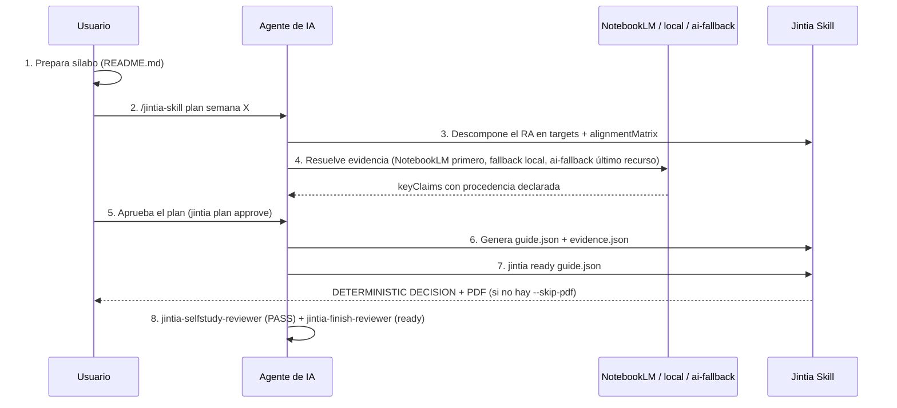
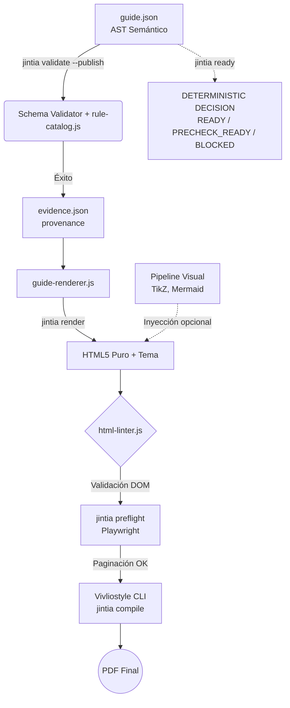

# Jintia

**Motor de Diseño Instruccional Editorial para Agentes de IA** (Claude, ChatGPT y Codex).

Jintia es una *skill* agéntica de código abierto diseñada para producir guías académicas modulares, estructuradas y listas para impresión o distribución digital, garantizando la trazabilidad entre el sílabo, los resultados de aprendizaje y la bibliografía verificable.

> [!NOTE]
> El cliente de escritorio y el instalador gráfico se mantienen en un repositorio independiente:
> [`jintia-desktop`](https://github.com/CharlieCardenasToledo/jintia-desktop).
> Este repositorio contiene únicamente la *skill* base, el motor de renderizado HTML, las pruebas y los artefactos de distribución.

## Capacidades Principales

Jintia ingiere sílabos, configuraciones institucionales y fuentes verificables para generar automáticamente guías de estudio. Su arquitectura incorpora:

- **Estructuración mediante AST (`guide.json`)**: Planificación instruccional y trazabilidad de evidencia con separación total entre contenido y diseño.
- **Motor Editorial HTML**: Renderizado nativo web y compilación a PDF de alta resolución mediante Vivliostyle.
- **Sistema Multitema**: Soporte para distintos perfiles visuales (ej. diseño técnico corporativo, libretas de ejercicios imprimibles).
- **Control de Calidad (Linter y Preflight)**: Validación estricta del esquema semántico y verificación estructural del DOM para evitar errores de impresión.
- **Flujo Multi-Agente**: Contratos especializados para delegación de tareas de investigación, renderizado de figuras y revisión académica.

## Uso y Flujo del Usuario

El usuario final interactúa con Jintia a través de su agente de IA de preferencia
siguiendo el nombre de invocación de cada superficie:

| Superficie | Invocación |
|---|---|
| Claude Code | `/jintia-skill` (no `/jintia`) |
| Codex / ChatGPT | `$jintia-skill` |
| CLI directa | `jintia <comando>` |

El flujo normal de una semana es:



1. **Preparación del entorno**: `README.md` actúa como sílabo canónico del curso (resultados de aprendizaje, horas, actividades calificadas), y opcionalmente `config/institution.json`.
2. **Plan antes de redactar**: `jintia plan` descompone el resultado de aprendizaje en `targets` y completa la matriz de alineación (enseñanza, práctica, feedback, evaluación, evidencia) para cada uno **antes** de escribir contenido. `jintia plan approve` bloquea si la matriz, el presupuesto de horas (`workloadBudget`) o el contrato de evaluación (`assessmentContract`) están incompletos.
3. **Evidencia con procedencia declarada**: jerarquía única — NotebookLM (3 intentos) → fuente local verificable → conocimiento del modelo (`ai-fallback`, último recurso, nunca fabrica bibliografía). Cada afirmación disciplinar central queda registrada en `evidence.json` con su `sourceMode`.
4. **Generación del AST**: el agente redacta la guía en el formato neutro `guide.json` (targets, `orientation.route`, práctica estructurada, evaluación con criterios) y cierra el plan con `jintia guide finalize`.
5. **Cierre determinista (`jintia ready`)**: corre en cadena `validate --publish` → procedencia de evidencia → bibliografía → render → html-lint → preflight → compile (PDF). Se detiene en el primer paso bloqueante.
6. **Revisión de agente**: `DETERMINISTIC DECISION: READY` es necesaria pero no suficiente — se exige además `PASS` de `jintia-selfstudy-reviewer` y `ready` de `jintia-finish-reviewer` antes de compartir el material.

## Arquitectura (Pipeline Editorial)

La *skill* opera mediante un flujo secuencial automatizado (el *Pipeline* Editorial) que garantiza calidad técnica y pedagógica:



1. **Ingesta de contenido (`jintia validate` / `--publish`)**: valida `guide.json` contra `guide.schema.json` y contra `rules/catalog.json` (fuente única de severidad/categoría de cada regla `JIN-*`). En modo publish, `targets`, `hours` y `evidence.json` dejan de ser opcionales.
2. **Procedencia de evidencia**: `evidence.json` se valida contra su propio esquema; el grafo target → claim → evidencia debe cerrar (todo keyClaim usado declara `targetId`, todo target tiene evidencia).
3. **Renderizado semántico (`jintia render`)**: `guide-renderer.js` construye HTML5 puro con el tema seleccionado (`jintia-clasico`, `jintia-tecnico` o `jintia-cuaderno`).
4. **Control de calidad de contenido (`html-linter.js`)**: reglas de accesibilidad (`JIN-HTM-*`) e instruccionales sobre el DOM resultante.
5. **Pipeline visual (figuras complejas)**: si la guía incluye diagramas, se invocan herramientas externas (TikZ, PlantUML, Mermaid, Vega-Lite, Graphviz) y las imágenes se inyectan en el HTML final.
6. **Preflight de paginación (`jintia preflight`)**: mediante Playwright, detecta viudas/huérfanas o tablas cortadas.
7. **Compilación PDF (`jintia compile`)**: delega la composición a **Vivliostyle** (CSS Paged Media).
8. **`jintia ready`**: orquesta los pasos 1-7 de un solo golpe y se detiene en el primer bloqueo; ver [`skill/commands/ready.md`](skill/commands/ready.md).

## Instalación

### Con npx (recomendado)

Requiere Node.js `>=22.13.0` (ver `engines` en `package.json`). Desde la raíz
del proyecto donde utilizarás Jintia, ejecuta:

```bash
npx @charlie.act7/jintia install
```

El instalador detecta los harnesses disponibles, solicita el alcance y confirma
antes de escribir. Para automatización sin preguntas:

```bash
npx @charlie.act7/jintia install --providers=claude,codex --scope=project --yes
```

Usa `npx @charlie.act7/jintia update` para actualizar una instalación gestionada
y reinicia Claude Code o Codex para que descubra la skill.

### Con Jintia Desktop

Descarga el instalador desde las
[releases de Jintia Desktop](https://github.com/CharlieCardenasToledo/jintia-desktop/releases).
La aplicación instala y actualiza una release verificada de la skill, conservando
la configuración personal.

### Manual

Cada [release](https://github.com/CharlieCardenasToledo/jintia/releases)
publica tres archivos verificables:

- `jintia-skill-X.Y.Z.zip`, para Claude;
- `jintia-openai-plugin-X.Y.Z.zip`, para ChatGPT y Codex;
- `jintia-release-manifest.json`, con compatibilidad, versiones y SHA-256.

Extrae el primer ZIP como `~/.claude/skills/jintia-skill`, o importa el plugin
universal mediante el gestor de plugins compatible. `SKILL.md` debe quedar en
la raíz de la skill instalada.

## NotebookLM MCP

La integración usa la versión fijada de
[`@charlie.act7/gemini-notebook-mcp`](https://www.npmjs.com/package/@charlie.act7/gemini-notebook-mcp),
también mantenida por Charlie Cárdenas Toledo, según
[`release/release-config.json`](release/release-config.json) — nunca `@latest`.
Jerarquía única de evidencia: NotebookLM (3 intentos) → fuente local
verificable → conocimiento del modelo (`ai-fallback`, último recurso). Ver
[`docs/notebooklm.md`](docs/notebooklm.md) para el detalle completo.

## Desarrollo

```bash
npm ci
npm --prefix skill ci
npm run docs:check
npm run skill:check
npm run release:check
npm run release:skill
npm run release:skill:check
```

Validación estructural para Codex:

```bash
python -X utf8 ~/.codex/skills/.system/skill-creator/scripts/quick_validate.py skill
```

Los tags `v*` ejecutan las pruebas, construyen los dos ZIP desde los blobs
canónicos de Git y publican el manifest, checksums y attestations de procedencia.

## Estructura

```text
skill/          Skill autocontenida, runtime, plantillas y pruebas
openai-plugin/  Empaque universal para ChatGPT y Codex
packages/       Fachadas y utilidades compartidas de la toolchain
release/        Esquema y configuración del contrato de publicación
scripts/        Verificación y construcción reproducible
```

## Origen del nombre

Jintia toma su nombre de **Jíntia**, palabra registrada en Shuar Chicham con el
significado de «camino». **Aarma jintia** aparece en el Currículo Nacional
Intercultural Bilingüe de la Nacionalidad Shuar para referirse a textos
instructivos. El uso del nombre no implica representación, aprobación ni
vinculación institucional con comunidades u organizaciones del pueblo Shuar.

Consulta [`docs/brand-guidelines.md`](docs/brand-guidelines.md) para la
atribución y fuentes completas.

## Licencia

MIT © 2026 Charlie Cárdenas Toledo. Las plantillas y recursos de terceros
conservan sus licencias propias; consulta [`THIRD_PARTY_NOTICES.md`](THIRD_PARTY_NOTICES.md).
